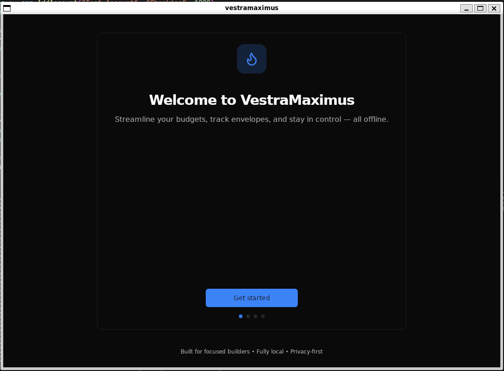
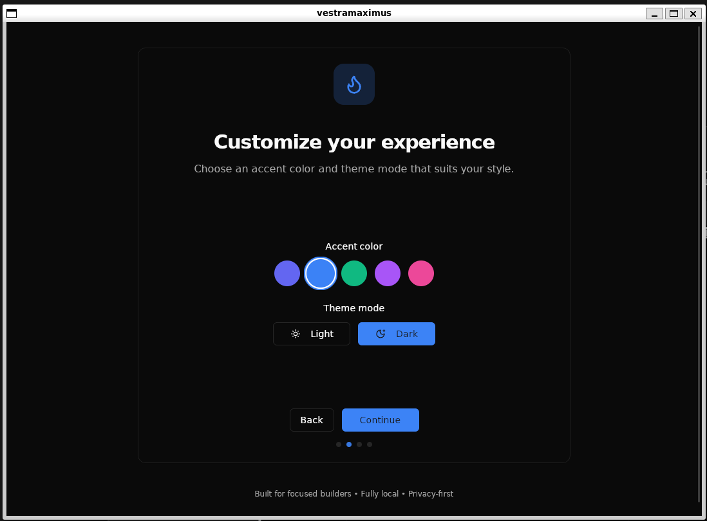
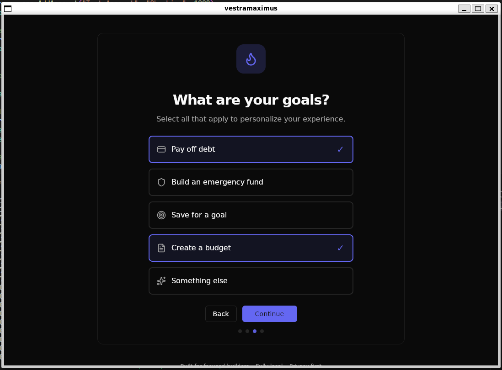
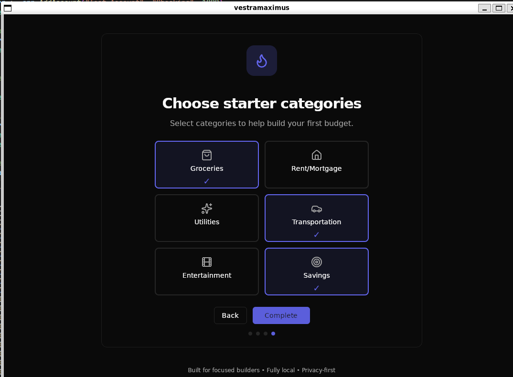
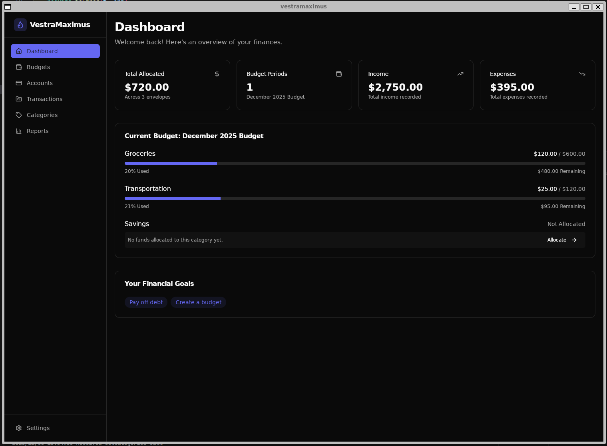
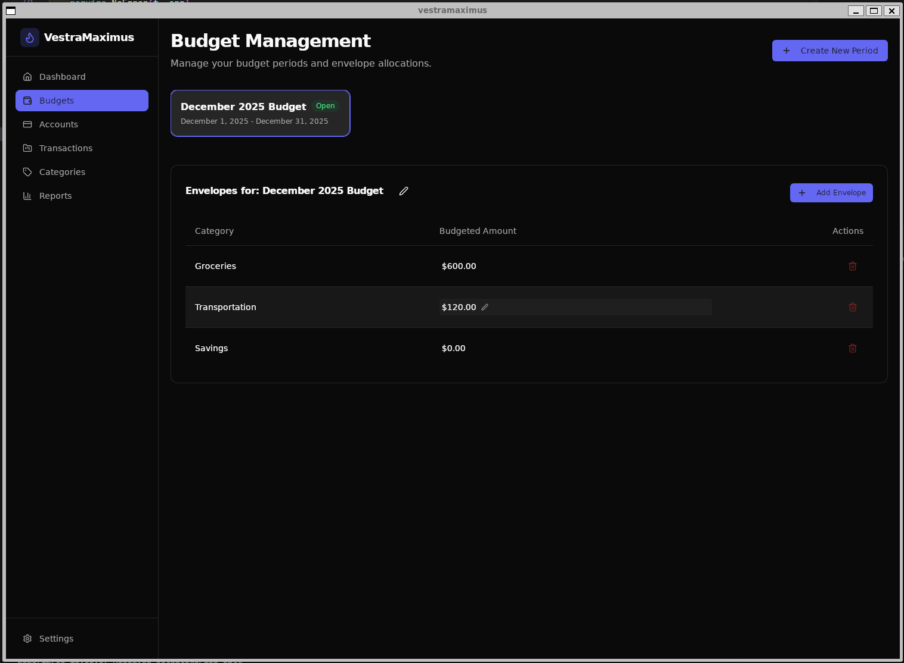
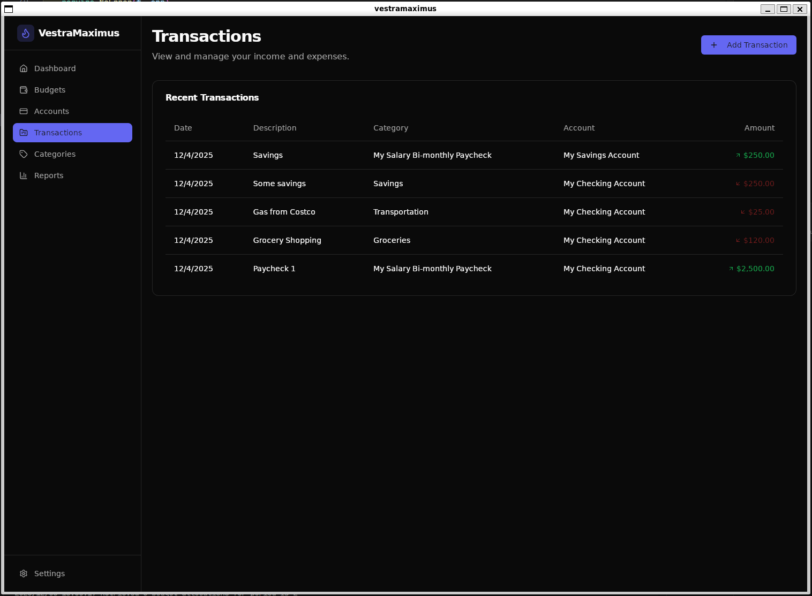
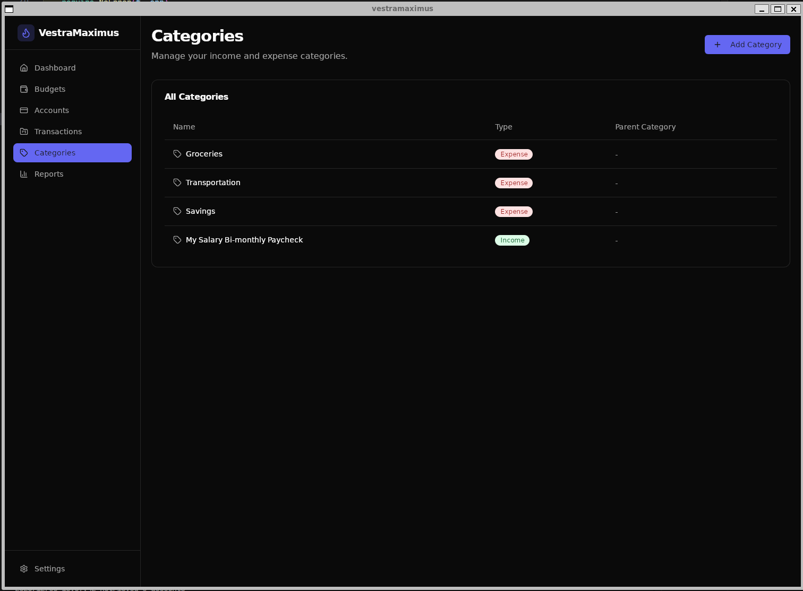
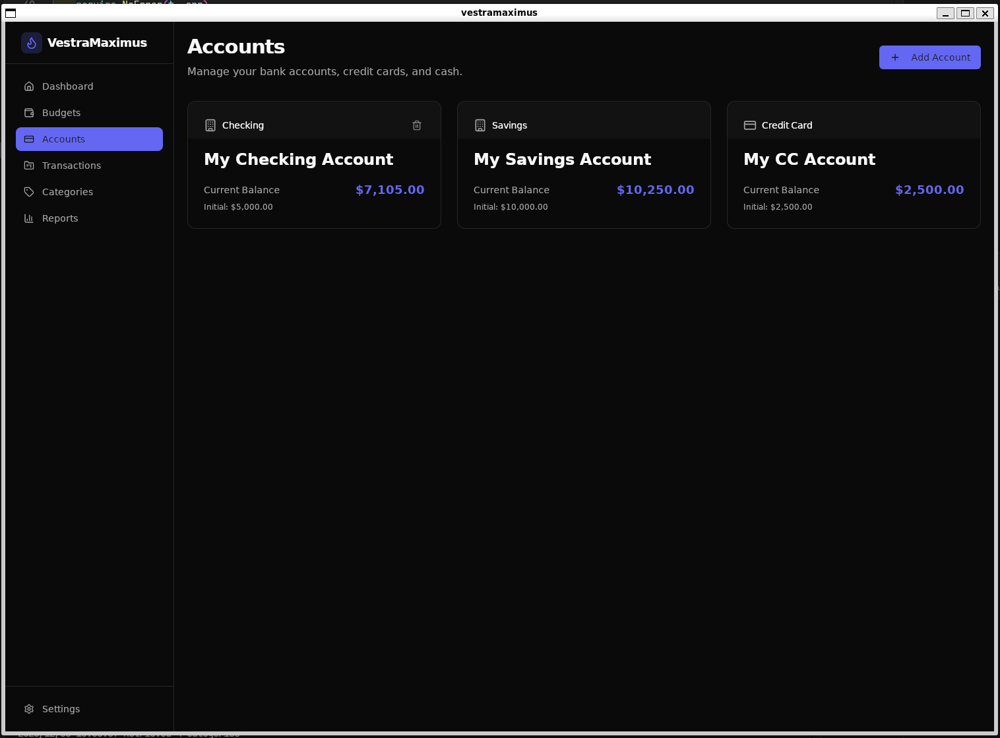
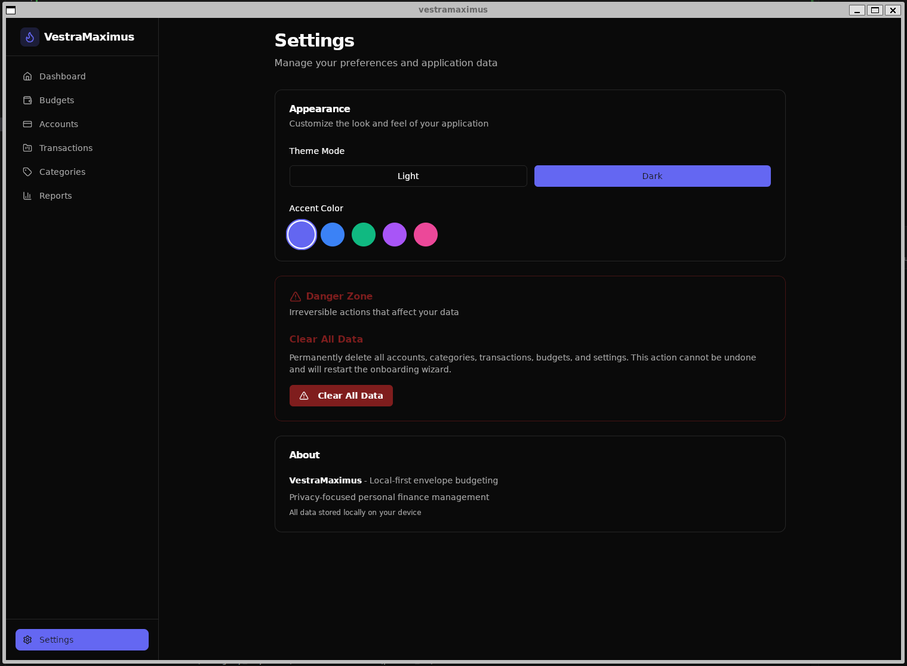

# VestraMaximus

> **A privacy-focused, local-first personal finance application.**

VestraMaximus is designed to replace spreadsheet-based budgeting with a streamlined, secure desktop application. Built with performance and privacy in mind, it ensures **your data never leaves your device**.

## 🚀 Key Features

*   **Envelope Budgeting**: Set allocations for categories and track your spending against them in real-time.
*   **Privacy First**: No cloud sync, no tracking. All data is stored locally in an encrypted SQLite database.
*   **Manual Transaction Management**: Quick and easy entry for income and expenses with detailed categorization.
*   **Visual Dashboard**: Interactive charts and graphs to visualize your spending habits and budget health.
*   **Crossover Support**: Available for Windows, macOS, and Linux.
*   **Themeable**: Full support for both **Light** and **Dark** modes.

## 🛠 Tech Stack

*   **Backend**: [Go](https://go.dev/) (powered by [Wails](https://wails.io/))
*   **Frontend**: [React](https://react.dev/) + [Vite](https://vitejs.dev/)
*   **Styling**: [Tailwind CSS](https://tailwindcss.com/) + [Radix UI](https://www.radix-ui.com/)
*   **Database**: SQLite

## 🏁 Getting Started

### Prerequisites

*   [Go 1.21+](https://go.dev/doc/install)
*   [Node.js 18+](https://nodejs.org/en/download/)
*   [Wails CLI](https://wails.io/docs/gettingstarted/installation)

### Installation

1.  Clone the repository:
    ```bash
    git clone https://gitlab.com/asonderman/vestramaximus.git
    cd vestramaximus
    ```

2.  Install frontend dependencies:
    ```bash
    cd frontend
    pnpm install
    ```

3.  Run the application in development mode:
    ```bash
    wails dev
    ```

4.  Build the application for your platform:
    ```bash
    wails build
    ```

If you have some issues and are on Ubuntu 24.04, check out the [contributing](CONTRIBUTING.md) file for some helpful tips.

## 📸 Screenshots

### Setup Wizard

| Intro | Customization |
| :---: | :---: |
|  |  |

| Goals | Categories |
| :---: | :---: |
|  |  |

### Application Views

**Dashboard**


**Budgets**


**Transactions**


**Categories**


**Accounts**


**Settings**


## 🏗 Data Model

```text
+----------------+          +--------------------+
| BudgetPeriod   |1        *| BudgetAllocation   |
|----------------|          |--------------------|
| id PK          |<--+   +--| id PK             |
| name           |   |   |  | period_id FK -----+
| start_date     |   |   |  | category_id FK     |
| end_date       |   |   |  | planned_amount     |
| status         |   |   |  +--------------------+
+----------------+   |   |
                     |   |     +----------------+
                     |   +----<| BudgetCategory |
                     |         |----------------|
                     |         | id PK          |
                     |         | name           |
                     |         | type (enum)    |
                     |         | parent_id FK?  |
                     |         +----------------+
                     |
                     |   +----------------+
                     |   +--<| Transaction    |
                         |----------------|
                         | id PK          |
                         | date           |
                         | amount (signed)|
                         | payee          |
                         | notes          |
                         | category_id FK |
                         | period_id FK   |
                         +----------------+

Backup(id PK, timestamp, filepath, status)
AuditLog(id PK, timestamp, action, entity, entity_id, summary)
```
> Note: `Transaction.period_id` is redundant but speeds up queries for “current budget.”